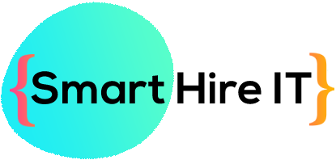

<h1 align="center">
  <br/><br/>
  SMART HIRE
</h1>
<p align="center">Built production-ready project with <b>backend</b> (Node JS), <b>frontend</b> (ReactJS, Next JS)<br/>and <b>Resume Analyser</b> (Stramlit, Python).

<p align="center"><a href="https://reactjs.org/" target="_blank"></a>&nbsp;<a href="https://nextjs.org/" target="_blank"></a>&nbsp;<a href="https://www.mongodb.com/" target="_blank"></a>&nbsp;<a href="https://nodejs.org/" target="_blank"></a>&nbsp;<a href="https://streamlit.io/" target="_blank"></a>&nbsp;<a href="https://www.python.org/" target="_blank"></a>&nbsp;</p>

# 🚀 Simplify Your Hiring Process with Our Application 🎉

The proposed application aims to simplify the hiring process by offering the following features:

## 👤 Job Seekers

- 📝 Upload your resume and create a profile with your personal information, education, work experience, skills, certifications, test scores, and other relevant information.
- 🔍 The app will automatically extract information from your resume, eliminating the need for manual input and resulting in a smoother and faster application process.
- 📑 You only need to rectify the information extracted from the resume, rather than entering everything manually.
- 🤝 Answer subjective questions to reduce duplicate applications and improve your chances of getting the job.
- 📈 Get feedback on your application status, skills you're missing, skills in high demand, salary statistics, and why you didn't get shortlisted for a certain job posting, etc.

## 💼 Recruiters

- 📌 Create job postings with eligibility criteria, job description, required skills, responsibilities, salary, and duration. Job postings are not visible to job seekers.
- 📊 The app uses machine learning algorithms to generate a Job Fit Score (JFS) for each applicant based on their eligibility criteria and other factors.
- 📋 View a suggested list of applicants based on their JFS and eligibility criteria.
- 🔒 The application ensures secure storage and handling of sensitive data.

## 🎉 Additional Features

- 📝 Customizable subjective questions for job seekers.
- 🕵️‍♂️ Additional criteria to resolve ties between two candidates, such as experience and other relevant factors.
- 🤖 Endless opportunities for expansion and customization. The possibilities for additional features are only limited by your imagination.

# 📌 How to Use

1. Job seekers upload their resumes and create profiles.
2. Recruiters create job postings with eligibility criteria.
3. Machine learning algorithms match the best candidates for the job based on their JFS and eligibility criteria.
4. Recruiters view a suggested list of applicants and select the most suitable candidate.
5. Job seekers receive feedback on their application status and ways to improve their profile.


## ⚡️ Quick start

**Local Setup || Project Structure**

- The project contains 5 broad directories.

```
*
├───client
├───cv-builder
├───server
├───resume-analyser
└───chat
```

- `client`: The frontend for the application.
- `cv-builder`: CV builder for making extensible resumes and CVs.
- `server`: The backend for the application.
- `resume-analyser`: The neccessare api for analysing resume.
  <br />

First of all clone the repository to your local machine.

```sh
git clone https://github.com/priyanshpsalian/SMART-COUPON
```
**Client**

For local setup of frontend:

- `cd client`
- `npm i`
- `npm start`
- Go to `localhost:3000`

Structure

```
src
├───assets
├───components
├───containers
└───index.js
```

Individual Component & Container Structure

```
component
├───component.jsx
└───component.css
```

**cv-builder**

For local setup:

- `cd cv-builder`
- `npm i`
- `npm start`
- Go to `localhost:3002`

**Server**

For local setup of backend:

- `cd server`
- `npm i`
- `npm start`
- Go to `localhost:3001`

```
server
├───controllers
├───middlewares
├───models
├───routes
└───package.json
```

**cv-builder**

The complete setup can be found in the [`resume-analyser` directory](./resume-analyser).

**chat**

For local setup:

- `cd chat`
- `npm i`
- `npm start`
- Go to `localhost:3003`

That's all you need to know to start! 🎉

# 🚀 Let's understand the projject in depth 🎉

<br>

<div align="center">

**[PROJECT PHILOSOPHY](https://github.com/chroline/well_app#-project-philosophy) •
[TECH STACK](https://github.com/chroline/well_app#-tech-stack) •
[CONTRIBUTING](https://github.com/chroline/well_app#%EF%B8%8F-contributing) •
[SPREAD THE WORD](https://github.com/chroline/well_app#-spread-the-word) •
[LICENSE](https://github.com/chroline/well_app#%EF%B8%8F-license)**

</div>

<br />

# 🧐 Project philosophy

> This project aims to simplify the hiring process by creating an application that allows job seekers to upload their resumes and create profiles with their personal information, education, work experience, skills, certifications, test scores, and other relevant information. The application will automatically extract information from the applicant's resume, eliminating the need for manual input and resulting in a smoother and faster application process for both recruiters and applicants.

> Recruiters can create job postings with eligibility criteria, job descriptions, required skills, responsibilities, salary, and set the duration of the job posting. The application will use machine learning algorithms to match the best candidates for the job based on their eligibility criteria and generate a score called ‘Job Fit Score’ or JFS for each applicant for each job posting. If there is a tie between two candidates, the application will consider additional criteria such as subjective questions, experience, and other relevant factors.

> The application will have subjective questions that candidates need to answer, eliminating duplicate applications. To further improve the user experience, the application will provide feedback to candidates on their application status, letting them know about what skills they are missing, what skills are in high demand, salary statistics, why they didn’t get shortlisted for a certain job posting, etc.

# 🛠️ Tech stack

Here's a brief high-level overview of the tech stack the Samrt Hire uses:

- React.js:A JavaScript library for building user interfaces.
- Next.js:A framework for building server-side rendered React applications.
- Node.js:A JavaScript runtime built on Chrome's V8 JavaScript engine that allows developers to run JavaScript on the server side.
- MongoDB:A NoSQL database that uses JSON-like documents with optional schemas.
- Streamlit:An open-source framework for building data science and machine learning web applications.
- Python: A high-level programming language used for various purposes including web development, data science, machine learning, and more.

# ✍️ Contributing

Interested in contributing to Smart Hire project? Thanks so much for your interest! We are always looking for improvements to the project and contributions from open-source developers are greatly appreciated.

To contribute to this project, please follow these steps:

1. Fork the repository
2. Create a new branch for your feature or bug fix
3. Commit your changes to the new branch
4. Push your changes to your forked repository
5. Submit a pull request to the original repository

# 🌟 Spread the word!

If you want to say thank you and/or support active development of the Well app:

- Add a GitHub Star to the project!
- Tweet about the project on your Twitter!
  - Tag [@PriyanshSalian](https://twitter.com/priyanshsalian)

Thanks so much for your interest in growing the reach of the Smart Hire!

# ⚠️ License

The Well app is free and open-source software licensed under the GNU General Public License v3.0. All designs were created by [Priyansh Salian](https://github.com/priyanshpsalian) and distributed under Creative Commons license (CC BY-SA 4.0 International).
